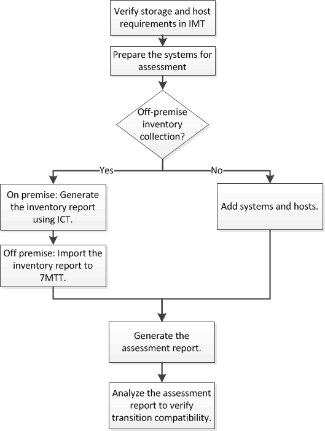

= Recopilación y evaluación de la información de inventario
:allow-uri-read: 
:icons: font
:imagesdir: ../media/

[role="lead"]
Es posible recoger información de inventario de las controladoras, los hosts y los switches FC. A continuación, puede evaluar las características y funcionalidades de estos sistemas e identificar cómo funcionan estas características y funcionalidades en la versión de ONTAP seleccionada para la transición.

Puede recopilar información de inventario de dos formas:

* Si la seguridad del entorno se lo permite, puede instalar la herramienta 7-Mode Transition Tool y, a continuación, usarla para recopilar la información de inventario.
* Puede importar el informe XML de inventario generado por la herramienta de recopilación de inventario y, a continuación, llevar a cabo la evaluación.

En ambos casos, debe utilizar Inventory Collect Tool 3.3 para recopilar el inventario.

