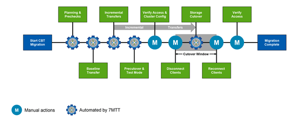

= Proceso de migración de datos y de configuración
:allow-uri-read: 
:icons: font
:imagesdir: ../media/

[role="lead"]
El proceso de migración de datos y configuraciones que utiliza la herramienta de transición de 7-Mode consta de las siguientes fases: Preparación, copia de datos de referencia, aplicación de la configuración (previa) y transición del almacenamiento. Si tiene volúmenes SnapLock para la verificación de la cadena de custodia, la verificación de la cadena de custodia será una fase adicional después de la transposición.

La siguiente imagen muestra las distintas fases del proceso de migración:

== Preparación

En esta fase, se ejecutan comprobaciones previas para verificar la funcionalidad de funciones. El proceso comprueba los sistemas de almacenamiento de 7-Mode para verificar que los volúmenes y la configuración estén listos para la migración a ONTAP. Comprueba que el clúster esté configurado correctamente y que pueda admitir la transición. Se deben resolver todos los errores antes de continuar con la transición. Aunque la herramienta permite continuar sin solucionar las advertencias, debe comprender el impacto de las advertencias antes de continuar con la transición. Puede ejecutar las comprobaciones previas varias veces para verificar que se hayan resuelto todos los errores.

Aunque el paso previo y los pasos de evaluación realizados durante la evaluación parecen ser similares, hay diferencias. El paso previo es una prueba más detallada que se centra en los sistemas de almacenamiento específicos identificados como los sistemas de origen de la migración (7-Mode) y de destino (ONTAP). El paso de evaluación solo evalúa los sistemas de origen de migración, comprobando las diferencias de funciones y funcionalidades con ONTAP.

== Copia de datos en línea de base

Se crean volúmenes nuevos en la SVM, se establece una relación de SnapMirror entre los volúmenes de 7-Mode y ONTAP, y se lleva a cabo una transferencia básica. Una vez completada la base, las transferencias incrementales se ejecutan automáticamente de acuerdo con una programación de copias de datos definida por el usuario. Los clientes y servidores que acceden al almacenamiento de origen permanecen en línea mientras se completa este paso.

Copiar datos requiere CPU, memoria y acceso al almacenamiento, lo que provoca que se utilicen recursos adicionales en el sistema de almacenamiento de origen. Se recomienda programar la actividad de copia de datos para que se produzca en periodos de menor actividad (preferiblemente, el uso de CPU deberá ser de alrededor del 50 %).

== Aplicar configuración (previa)

Esta fase incluye las transferencias incrementales de SnapMirror y la información de configuración se aplica al sistema ONTAP, a la SVM y a los volúmenes. De manera opcional, puede probar los volúmenes de ONTAP que se están realizando la transición antes de la transición del almacenamiento.

Si bien se aplica la mayoría de la configuración, algunas acciones se aplazan para la transposición del almacenamiento: Por ejemplo, aplicando cuotas.

Las direcciones IP de 7-Mode seleccionadas para la transición se crean en estado administrativo inactivo. Las nuevas direcciones IP seleccionadas para la transición se crean en estado administrativo up. Estas nuevas direcciones IP se pueden utilizar para verificar el acceso a los datos durante las pruebas previas.

Se recomienda ejecutar la fase Apply Configuration (creación previa) unos días o semanas antes del plazo de transposición planificado. Esta actividad ayuda a verificar que todas las configuraciones se aplican correctamente y si es necesario realizar cambios.

TIP: Aunque no se requieren actualizaciones incrementales, es una práctica recomendada realizar una transferencia incremental lo más cerca posible de la transición del almacenamiento para minimizar el tiempo que se desconectan los clientes.

== Transición del almacenamiento

En un nivel elevado durante la transición de almacenamiento, se desconectan los clientes, se realiza una transferencia de datos final, se rompe la relación de SnapMirror y se vuelven a conectar los clientes manualmente.

Si se desconectan clientes o servidores del volumen de almacenamiento de origen, se evitan las escrituras adicionales mientras se ejecuta la copia final. Antes de desconectar a los clientes, se recomienda realizar una actualización incremental para minimizar el tiempo de inactividad.

El acceso al almacenamiento debe desconectarse solo para los volúmenes que se están migrando. El acceso al almacenamiento se puede interrumpir por el lado del almacenamiento o por el lado del cliente. La mejor práctica es interrumpir la conectividad del almacenamiento. Por ejemplo, si un cliente CIFS accede a un volumen denominado «'user01'» en un sistema de almacenamiento de 7-Mode, puede utilizar la `cifs terminate -v user01` Comando para desactivar el acceso a todos los recursos compartidos CIFS del volumen (interrupción del acceso del cliente desde el almacenamiento). Como resultado de la migración, las direcciones IP, los puntos de montaje o incluso los nombres de uso compartido pueden cambiar y, por lo tanto, el acceso del cliente también puede interrumpirse desde el lado del cliente. Siempre que los clientes no puedan escribir datos nuevos en el contenedor de almacenamiento que se está migrando, puede utilizar cualquiera de estos métodos o ambos para interrumpir el acceso.

Después de desconectar a los clientes, la herramienta 7-Mode Transition Tool ejecuta una copia final para que los conjuntos de datos de origen y de destino se encuentren a la paridad. La herramienta de transición de 7-Mode configura las LIF de datos en la SVM. En este momento, también se aplican a la SVM algunos cambios de configuración que no se realizaron durante la transición previa, como aplicar cuotas y configuraciones DE SAN.

Una vez finalizada la transición del almacenamiento, puede volver a conectar los clientes manualmente y validar el acceso a los datos. La validación del acceso a los datos implica la comprobación de que los clientes acceden al sistema ONTAP correctamente y de que todos los permisos funcionan según lo esperado.

== Verificación de la cadena de custodia de los volúmenes de SnapLock

Una vez completada la transición, puede activar la operación de cadena de custodia de los volúmenes de SnapLock en el proyecto. Esta operación no es obligatoria y sólo es obligatoria si la verificación de la cadena de custodia es esencial para la transición de volúmenes de SnapLock. Puede realizar esta operación en todos los volúmenes de SnapLock del proyecto o en un subconjunto de volúmenes de SnapLock del proyecto. Se admite la verificación de la cadena de custodia tanto para volúmenes SnapLock empresariales como para el cumplimiento normativo. La verificación de cadena de custodia solo se admite para volúmenes de SnapLock de lectura y escritura, y no se admite para volúmenes SnapLock de solo lectura.

IMPORTANT: No se admite la verificación de cadena de custodia en volúmenes SnapLock que tienen nombres de archivo con caracteres no ASCII.

El flujo de trabajo de verificación solo se admite en la interfaz gráfica de usuario de 7-Mode Transition Tool y no se admite en el flujo de trabajo de la CLI.

La operación de verificación de la cadena de custodia realiza lo siguiente:

* Enumera todos los archivos WORM de volúmenes 7-Mode
* Calcula la huella de cada archivo WORM enumerado anteriormente en los volúmenes 7-Mode y los volúmenes ONTAP convertidos
* Genera un informe con detalles sobre el número de archivos con huellas digitales coincidentes y no coincidentes, así como el motivo de la discrepancia

Los datos de huellas digitales de todos los archivos WORM se almacenan en un volumen ONTAP que se proporciona durante la fase de planificación.

NOTE: En función del número de archivos de los volúmenes de 7-Mode, el proceso de verificación de la cadena de custodia puede tardar un tiempo considerable (días o semanas).
