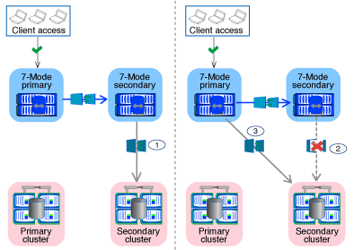

= Cómo realiza la transición de volúmenes en una relación de SnapMirror
:allow-uri-read: 
:icons: font
:imagesdir: ../media/

[role="lead"]
Si desea realizar la transición de los volúmenes de 7-Mode que se encuentran en una relación de SnapMirror, primero se debe realizar la transición de los volúmenes secundarios. A continuación, se establece una relación de SnapMirror para volúmenes entre los volúmenes primarios de 7-Mode y los volúmenes secundarios de ONTAP.

Después de trasladar los volúmenes primarios, la herramienta 7-Mode Transition Tool establece una relación de SnapMirror para volúmenes entre los volúmenes primarios y secundarios de ONTAP.

NOTE: La herramienta de transición de 7-Mode no realiza automáticamente la transición de los volúmenes de cumplimiento de SnapLock que se encuentran en una relación de SnapMirror. Todos los volúmenes de SnapLock Compliance que se encuentren en una relación de SnapMirror deben realizar la transición como volúmenes independientes. Una vez que se realiza la transición de los volúmenes primario y secundario de SnapLock Compliance a ONTAP, debe realizar manualmente la operación de resincronización de SnapMirror entre estos volúmenes.

Puede realizar las comprobaciones previas, la copia básica, las transferencias incrementales y aplicar la configuración (transición previa) en los proyectos secundarios y primarios simultáneamente; sin embargo, la transición del almacenamiento del proyecto secundario debe realizarse primero.

== Fase de preparación

En esta fase, se seleccionan el sistema 7-Mode, el clúster, los volúmenes y las direcciones IP. La herramienta de transición de 7-Mode realiza las siguientes tareas en esta fase:

. Añade información de volumen y sistema de almacenamiento de 7-Mode
. Recopila información sobre los volúmenes de origen de 7-Mode y las relaciones de SnapMirror:
+
** Para realizar la transición de un volumen secundario, recopile información sobre el sistema primario 7-Mode
** Para la transición de un volumen primario, se recoge información sobre el sistema secundario de 7-Mode

. Realiza las comprobaciones previas de la transición
. Añade información sobre el clúster, la SVM y el agregado
. Recopila direcciones IP que se deben configurar en la SVM:
+
** Selección de las direcciones IP existentes en el sistema 7-Mode
** Especifique las nuevas direcciones IP que se deben configurar en la SVM
+

NOTE: La herramienta no admite la transición de LIF de iSCSI y FC (SAN). Antes de la transición, debe configurar manualmente las LIF SAN en la SVM.

. Crea los programas de copia de datos para transferencias iniciales e incrementales.
. Si el proyecto contiene volúmenes SnapLock, recopila información sobre los volúmenes SnapLock de lectura y escritura para los que se requiere verificación de cadena de custodia y detalles sobre el volumen ONTAP que almacena los datos de huellas digitales generados durante la operación de verificación de cadena de custodia.
+

NOTE: La verificación de la cadena de custodia SnapLock solo se admite para volúmenes de SnapLock de 7-Mode de lectura/escritura. No se admite para volúmenes de solo lectura. No se admite la verificación de la cadena de custodia SnapLock en los volúmenes SnapLock que contienen archivos con nombres que no son ASCII.

. Planifica la transición de la configuración seleccionando las configuraciones de 7-Mode que deben realizarse la transición a la SVM de destino y los volúmenes de destino.

No es necesario modificar los objetos (volúmenes, direcciones IP, información del sistema, etc.) de la controladora después de corregir los errores y advertencias que se notifican en las comprobaciones previas.

== Fase de copia de datos

En esta fase, los datos de los volúmenes 7-Mode se copian a los volúmenes ONTAP. La herramienta de transición de 7-Mode realiza las siguientes tareas en esta fase:

. Crea los volúmenes ONTAP con acceso de solo lectura
. Configure una relación entre iguales entre el sistema 7-Mode y la SVM
. Establece una relación de SnapMirror entre los volúmenes de 7-Mode y los volúmenes de ONTAP
. Completa la transferencia de datos inicial según las entradas de la programación
. Realiza actualizaciones programadas de copias de datos de SnapMirror en los volúmenes de ONTAP

== Aplicar la fase de configuración (previa)

Es una práctica recomendada ejecutar *aplicar configuración* unos días o semanas antes del plazo de transposición planificado. Estas comprobaciones previas le permiten disponer de suficiente tiempo para verificar que todas las configuraciones se aplican correctamente y si es necesario realizar cambios.

En esta fase, se copian las configuraciones de los volúmenes de 7-Mode a los volúmenes de ONTAP.

Existen dos modos para la fase aplicar configuración (precutover): La lectura/escritura previa y la lectura/escritura previa.

El modo de lectura/escritura previa no se admite cuando el proyecto contiene lo siguiente:

* Los volúmenes SAN y el clúster de destino ejecutan Data ONTAP 8.3.1 o una versión anterior
+
En este caso, las siguientes configuraciones no se aplican en la fase Apply Configuration (transición previa), sino que se aplican durante la fase de transposición:

+
** Configuraciones SAN
** Configuraciones de programaciones de Snapshot

* Volúmenes de cumplimiento de normativas de SnapLock
+
Si el proyecto contiene volúmenes de cumplimiento de SnapLock, las configuraciones de la programación de Snapshot no se aplican en la fase Apply Configuration (creación previa). En su lugar, estas configuraciones se aplican durante la fase de transposición.

+
xref:concept_considerations_for_transitioning_of_snaplock_compliance_volumes.adoc[Consideraciones para la transición de volúmenes de cumplimiento de SnapLock].

Si el clúster de destino ejecuta Data ONTAP 8.3.1 o una versión anterior y desea ejecutar la operación Apply Configuration (creación previa) en el modo de lectura/escritura para volúmenes NAS, debe crear proyectos independientes para los volúmenes NAS y SAN. Esta acción es necesaria porque el modo de lectura/escritura aplicar configuración (previa) no es compatible si tiene volúmenes SAN en el proyecto.

Si el proyecto contiene volúmenes de SnapLock Compliance y desea ejecutar la operación Apply Configuration (creación previa) en modo de lectura/escritura para volúmenes que no sean de SnapLock Compliance, debe crear proyectos independientes para volúmenes de SnapLock Compliance y que no sean de SnapLock Compliance. Esta acción es necesaria porque el modo de lectura/escritura aplicar configuración (previa) no es compatible si tiene volúmenes de SnapLock Compliance en el proyecto.

La herramienta realiza los siguientes pasos en el *modo de sólo lectura previa*:

. Realiza una actualización incremental de volúmenes de 7-Mode a volúmenes de ONTAP
. Rompe la relación de SnapMirror entre volúmenes de 7-Mode y volúmenes de ONTAP
+

NOTE: Para los volúmenes de cumplimiento normativo de SnapLock, la relación de SnapMirror entre el volumen de 7-Mode y los volúmenes de ONTAP no se rompe. Esto se debe a que la operación de resincronización de SnapMirror entre los volúmenes de 7-Mode y ONTAP no es compatible con los volúmenes de cumplimiento de normativas de SnapLock.

. Recopila configuraciones de volúmenes de 7-Mode y aplica las configuraciones a los volúmenes de ONTAP y SVM
. Configura las LIF de datos en la SVM:
+
** Las direcciones IP existentes de 7-Mode se crean en la SVM en estado administrativo inactivo.
** Se crean nuevas direcciones IP en la SVM con el estado administrativo up.

. Vuelve a sincronizar la relación de SnapMirror entre volúmenes de 7-Mode y volúmenes ONTAP

Los siguientes pasos se realizan en el *modo de lectura/escritura previa*:

. Realiza una actualización incremental de volúmenes de 7-Mode a volúmenes de ONTAP
. Rompe la relación de SnapMirror entre volúmenes de 7-Mode y volúmenes de ONTAP
. Recopila configuraciones de volúmenes de 7-Mode y aplica las configuraciones a los volúmenes de ONTAP y SVM
. Configura las LIF de datos en la SVM:
+
** Las direcciones IP existentes de 7-Mode se crean en la SVM en estado administrativo inactivo.
** Se crean nuevas direcciones IP en la SVM con el estado administrativo up.

. Prueba el acceso a los datos de lectura/escritura en ONTAP Volumes durante las pruebas de aplicación de configuración (previa)
+
Después de aplicar la configuración, estos volúmenes ONTAP estarán disponibles para el acceso de lectura/escritura. Después de aplicar la configuración, los volúmenes ONTAP están disponibles para el acceso de lectura/escritura para que se pueda probar el acceso a los datos de lectura/escritura en estos volúmenes durante la prueba de aplicar configuración (previa).

. Manual: Verificación de las configuraciones y el acceso a los datos en ONTAP
. Manual: Finalizar la prueba
+
Los volúmenes ONTAP se resincronizan.

== Fase de transición del almacenamiento (volúmenes secundarios)

En la siguiente ilustración, se muestra la transición de un volumen secundario:

|===
| Fase | Pasos 

 a| 
Transición del almacenamiento (volúmenes secundarios)
 a| 
. La transición de los volúmenes secundarios
. Separación y eliminación de la relación de SnapMirror entre los volúmenes secundarios
. Establecer una relación de recuperación ante desastres entre los volúmenes primario de 7-Mode y secundario de ONTAP

|===
La herramienta de transición de 7-Mode realiza las siguientes tareas en esta fase:

. Opcional: Realiza una actualización de SnapMirror bajo demanda en los volúmenes secundarios de ONTAP
. Manual: Desconexión del acceso del cliente, si es necesario
. Realiza una actualización final de SnapMirror desde el volumen secundario de 7-Mode al volumen secundario de ONTAP
. Rompe y elimina la relación de SnapMirror entre el volumen secundario de 7-Mode y el volumen secundario de ONTAP, y hace que los volúmenes de destino sean de lectura/escritura
. Aplica la configuración de Snapshot schedules, si el clúster de destino ejecuta Data ONTAP 8.3.0 o 8.3.1 y el proyecto contiene volúmenes DE SAN
. Aplica configuraciones SAN, si el clúster de destino ejecuta Data ONTAP 8.3.1 o una versión anterior
+

NOTE: Todos los iGroups necesarios se crean durante esta operación. En los volúmenes secundarios, no se admite la asignación de LUN a iGroups durante la operación de transposición. Debe asignar manualmente las LUN secundarias después de completar la operación de transición de almacenamiento de los volúmenes primarios. Sin embargo, para los volúmenes independientes incluidos en el proyecto secundario, se asignan LUN a los iGroups durante esta operación.

. Aplica configuraciones de cuotas, si las hubiera
. Establece una relación de SnapMirror entre los volúmenes en el sistema primario 7-Mode y los volúmenes secundarios ONTAP
+
La programación de SnapMirror que se usa para actualizar las relaciones de SnapMirror entre los volúmenes primarios de 7-Mode y los volúmenes secundarios de 7-Mode se aplica a las relaciones de SnapMirror entre los volúmenes primarios de 7-Mode y los volúmenes secundarios de ONTAP.

. Elimina las direcciones IP de 7-Mode existentes seleccionadas para la transición del sistema 7-Mode y cambia el estado de las LIF de datos en la SVM al estado administrativo
+

NOTE: La herramienta de transición de 7-Mode no realiza la transición de los LIF DE SAN.

. Opcional: Desconectar los volúmenes de 7-Mode

== Fase de transición del almacenamiento (volúmenes primarios)

En la siguiente ilustración, se muestra la transición de un volumen primario:

image::../media/transition_primary.gif[transición primaria]

|===
| Fase | Pasos 

 a| 
Transición del almacenamiento (volúmenes primarios)
 a| 
. Para cambiar los volúmenes primarios
. Desconexión de clientes del sistema 7-Mode (transición del almacenamiento)
. Separación y eliminación de la relación de recuperación ante desastres entre ONTAP los volúmenes primario y secundario de 7-Mode
. Separación y eliminación de la relación de SnapMirror entre los volúmenes principales
. Configurar una relación entre iguales de SVM entre los volúmenes primario y secundario de ONTAP
. Volver a sincronizar la relación de SnapMirror entre volúmenes de ONTAP
. Habilitar el acceso de los clientes a volúmenes de ONTAP

|===
La herramienta de transición de 7-Mode realiza las siguientes tareas en esta fase:

. Opcional: Realiza una actualización de SnapMirror bajo demanda en los volúmenes secundarios de ONTAP
. Manual: Desconexión del acceso del cliente desde el sistema 7-Mode
. Realiza una actualización incremental final desde el volumen primario de 7-Mode y el volumen primario de ONTAP
. Rompe y elimina la relación de SnapMirror entre el volumen primario de 7-Mode y el volumen primario de ONTAP, y hace que los volúmenes de destino sean de lectura/escritura
. Aplica la configuración de programaciones de Snapshot si el clúster de destino ejecuta Data ONTAP 8.3.0 o 8.3.1 y el proyecto contiene volúmenes DE SAN
. Aplica configuraciones SAN, si el clúster de destino ejecuta Data ONTAP 8.3.1 o una versión anterior
. Aplica configuraciones de cuotas, si las hubiera
. Rompe y elimina la relación de SnapMirror entre el volumen primario de 7-Mode y el volumen secundario de ONTAP
. Configurar relaciones entre iguales de clústeres y relaciones entre iguales de SVM entre los clústeres primario y secundario
. Configuración de una relación de SnapMirror entre los volúmenes de ONTAP primario y secundario
. Vuelve a sincronizar la relación de SnapMirror entre los volúmenes ONTAP
. Elimina las direcciones IP de 7-Mode existentes seleccionadas para la transición del sistema 7-Mode y cambia el estado de las LIF de datos de la SVM principal a la instancia de administración
+

NOTE: La herramienta de transición de 7-Mode no realiza la transición de los LIF DE SAN.

. Opcional: Desconectar los volúmenes de 7-Mode

== Proceso de verificación de la cadena de custodia de los volúmenes de SnapLock

Realice la operación de verificación de la cadena de custodia.

. Enumera todos los archivos WORM de volúmenes 7-Mode
. Calcula la huella de cada archivo WORM en los volúmenes de 7-Mode (enumerados en el paso anterior) y calcula la huella digital del archivo WORM correspondiente en los volúmenes ONTAP convertidos.
. Genera un informe con detalles sobre el número de archivos con huellas digitales coincidentes y no coincidentes, así como el motivo de la discrepancia

[NOTE]
====
* La operación de verificación de cadena de custodia solo se admite en volúmenes SnapLock de lectura y escritura que tienen nombres de archivos con caracteres ASCII.
* Esta operación puede tardar bastante tiempo en función del número de archivos en los volúmenes de SnapLock de 7-Mode.

====

== Pasos posteriores a la transición

Una vez que la fase de transición se haya completado correctamente y la transición se haya completado, debe realizar las siguientes tareas posteriores a la transición:

. Realice los pasos manuales para realizar las funciones de transición que estaban disponibles en el sistema 7-Mode, pero la herramienta no realizó la transición automática al SVM.
. Si el clúster de destino ejecuta Data ONTAP 8.3.1 o una versión anterior, debe asignar manualmente los LUN secundarios.
. Para las transiciones SAN, vuelva a configurar manualmente los hosts.
+
http://docs.netapp.com/ontap-9/topic/com.netapp.doc.dot-7mtt-sanspl/home.html["Transición y corrección de hosts de SAN"]

. Asegurarse de que la SVM está lista para servir datos a los clientes; para ello, se comprueban lo siguiente:
+
** Los volúmenes en la SVM están en línea y de lectura/escritura.
** Las direcciones IP incluidas en la transición están activas y accesibles en la SVM.

. Redirija el acceso de los clientes a los volúmenes ONTAP.

*Información relacionada*

xref:task_transitioning_volumes_using_7mtt.adoc[Migración de datos y configuración desde volúmenes de 7-Mode]
