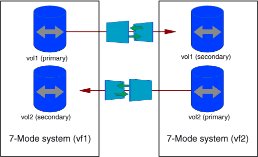

= Escenarios para seleccionar volúmenes en un proyecto
:allow-uri-read: 
:icons: font
:imagesdir: ../media/

[role="lead"]
La planificación de una composición de proyecto y la decisión de los volúmenes de 7-Mode para realizar la transición en una única operación de transición pueden ayudar a reducir el tiempo de inactividad de las aplicaciones. Comprender algunas situaciones hipotéticas de ejemplo puede ayudarle a crear proyectos en su entorno.

== Relación bidireccional de SnapMirror

Para realizar la transición de una relación de SnapMirror bidireccional, debe crear proyectos de transición diferentes para cada volumen.

Por ejemplo, como se muestra en la siguiente ilustración, considere una relación de SnapMirror para volúmenes entre vf1:vol1 (principal) en el sistema 1 y vf2:vol1 (secundario) en el sistema 2. De forma similar, existe otra relación de SnapMirror para volúmenes entre vf2:vol2 (principal) en el sistema 2 y vf1:vol2 (secundario) en el sistema 1.

No puede combinar los volúmenes vf1:vol1 y vf1:vol2 en un proyecto de transición. Del mismo modo, no se pueden combinar los volúmenes vf2:vol1 y vf2:vol2 en un proyecto de transición. Debe crear proyectos de transición independientes para cada volumen para que realicen la transición de la relación de SnapMirror para volúmenes.

== Volúmenes con configuración CIFS

Debe agrupar los volúmenes que tienen configuración CIFS en un proyecto para que toda la configuración relacionada con CIFS se realice una transición total al SVM.

Por ejemplo, si 10 volúmenes de un sistema 7-Mode o una unidad vFiler tienen recursos compartidos CIFS asociados, ruta de búsqueda de directorios iniciales y configuración de auditoría, estos 10 volúmenes se tendrán que realizar en un proyecto . De este modo se garantiza que todos los volúmenes y la configuración CIFS se apliquen por completo a la SVM después de la transición.

== Relación de SnapMirror entre un volumen primario y varios volúmenes secundarios

Si existe una relación de SnapMirror entre un volumen primario y varios volúmenes secundarios y si todos los volúmenes secundarios están en la misma controladora de 7-Mode, puede crear un proyecto secundario para agrupar todos los volúmenes secundarios y completar la transición de todos los volúmenes secundarios de ese proyecto. A continuación, puede crear un proyecto principal para migrar el volumen primario y completar la transición de SnapMirror.
