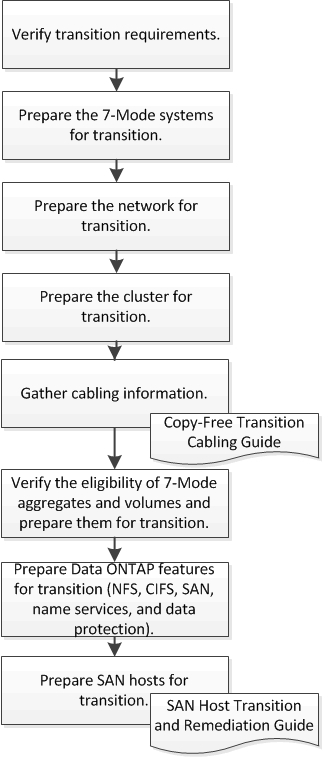

= Preparar la transición sin copias
:allow-uri-read: 
:icons: font
:imagesdir: ../media/

[role="lead"]
Antes de iniciar la transición sin copias, debe identificar la pareja de ha de 7-Mode para la transición, comprender los requisitos y las restricciones para la migración, y preparar los sistemas 7-Mode y el clúster para la transición. También debe tener en cuenta las funciones de Data ONTAP que son compatibles y no se admiten para la transición.

*Información relacionada*

https://["Herramienta de matriz de interoperabilidad de NetApp"]
